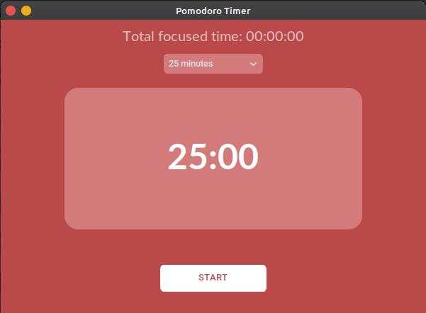

### README for Pomodoro Timer

## Pomodoro Timer

This is a simple Pomodoro Timer app built using `customtkinter`, `tkinter`, `Pillow`, and `pygame`.

## Screenshots
#### Home screen


### Features

- Timer with start and pause buttons
- Task entry field
- Plays a sound when the timer ends

### Requirements

- Python 3
- CustomTkinter
- Pillow
- Pygame

### Installation

1. **Clone the repository:**
   ```bash
   git clone https://github.com/KrystynaLysenko/pomodoro_timer.git
   cd pomodoro-timer
   ```

2. **Install the required packages:**
   ```bash
   pip install customtkinter pillow pygame
   ```

### Usage

1. **Run the app:**
   ```bash
   python pomodoro_timer.py
   ```

2. **Using the Timer:**
   - Click "START" to start the timer.
   - Click "PAUSE" to pause the timer.
   - Enter tasks in the task entry field.

### Notes

- Make sure the `bell.wav` file is in the `assets` folder.
